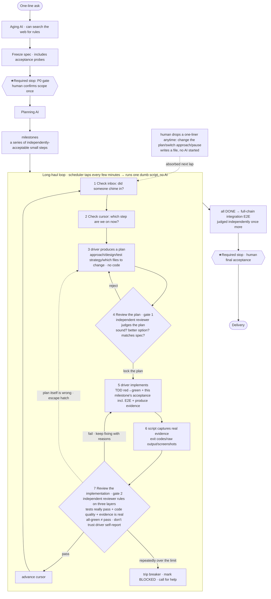

**English** · [中文](./README.zh-CN.md)

# longhaul-builder

**One-line ask → AI runs autonomously for the long haul → a medium-sized (weeks-long) project gets built from scratch.**

A **portable, agent- and infrastructure-agnostic** "long-haul autonomous build loop." You just describe what you want, and it keeps making progress unattended: it clarifies the requirements, writes a spec, breaks the work into steps, then hangs an AI self-driving loop on it to implement them one by one — it resumes after a crash, calls for help when stuck, and hands off to you for final acceptance.

> The **single source of truth** for design and decisions is [`DESIGN.md`](./DESIGN.md) (the design rationale is in Chinese); installation steps are in [`INSTALL.md`](./INSTALL.md). This README is navigation only.

---

## What this is / why it's valuable

The plain "ask an LLM to write some code" workflow is mature, but it only runs for the short haul — once the context grows long it drifts off course, forgets the goal, and self-reports "passed" without real evidence.

The value of this framework is that it **can run unattended for the long haul without drifting**:

- **All state lives in files on disk**, and the AI is never resident — every step "wakes up, does one step, and dies," so it never accumulates long context or drifts.
- **Every step anchors to the spec**, and passes two independent reviews (review-the-plan + review-the-implementation); it doesn't trust the AI's self-report, only real run evidence.
- **Resumes after a crash**: kill the session anytime, switch machines, come back the next day — it picks up losslessly from the files.
- **Trips a breaker when stuck**: after consecutive failures hit the limit it stops, marks BLOCKED, and calls for help, instead of spinning forever.
- **Humans are required to stop at only 2 points** (confirm the requirement scope, final acceptance); everything else is automatic — and you can still drop a one-liner to intervene anytime.

If a build task can be finished in the short haul, you don't need this; it's designed for "medium-to-large projects that need multiple steps and run for a long time."

---

## Quick start (you only talk to the AI; it runs itself)

Prerequisites: the `claude` (and/or `codex`) CLI + `git` + `python3`. Clone this repo into your agent's skill directory (the repo itself is a skill, so cloning installs it) and add `bin/` to your PATH. See [`INSTALL.md`](./INSTALL.md) for details.

Then **just tell your coding agent (or a chat entry point wired into IM)**:

> "I want to build a new project: <background / what I want it to become>"

The AI will automatically run through this chain:

1. **Clarify the requirements** (human stop 1: confirm scope)
2. Automatically write the spec and break it into a series of independently-acceptable small steps (milestones)
3. Hang the self-driving loop on it: each tick produces a plan → an independent judge reviews the plan → TDD red/green implementation → run real probes to gather evidence → an independent judge reviews the implementation
4. You walk away; it runs by itself, and comes find you when it's stuck or done
5. **Final acceptance** (human stop 2)

Underlying CLI entry points: `lhb new | plan | confirm | run | status | say`.

---

## The run flow at a glance



**Three key ways to read it**:

- The only resident things are the 2 cheapest ones — **the scheduler heartbeat + files on disk**; the AI is never resident, only "woken up to do one step and then dies."
- Humans **are required to stop at only 2 ★ points** (confirm scope / final acceptance); everything else can be interjected anytime (inbox), and if you don't interject it runs on its own.
- Not drifting = all state in files + short-lived AI that doesn't accumulate long context + every step anchored to the spec + a breaker as a backstop.

---

## Dependency contract (you may depend only on these shallow, portable things)

1. A coding agent that can read/write files + run a shell ("one bot")
2. `git` + directory conventions (the state ledger)
3. A scheduler that can wake things on a timer / repeatedly (cron / CI / a foreground while-loop / flock)

**Not bound to any specific team or company infrastructure** — the scheduler, judge, dashboard, and notifications can all be wired in afterward, but the core depends on none of them.

---

## Architecture / structure

| Path | Role | Status |
| --- | --- | --- |
| `DESIGN.md` | Design single source of truth (two layers + MVP + risks) | ✅ |
| `engine/state.py` | State ledger / program counter (deterministic core, CLI + library) | ✅ self-test 10/10 |
| `engine/test_state.py` | Four-column evidence-table self-test for the state machine | ✅ |
| `engine/age.*` | Aging scaffold: one-liner → Socratic follow-up questions + spec.md skeleton | ✅ skeleton (needs a real agent to flesh out) |
| `engine/plan.*` | Decomposition scaffold: spec.md → milestones.json skeleton | ✅ skeleton (needs a real agent to flesh out) |
| `engine/loop.*` | Long-haul driver loop (deterministic tick + two gates + breaker + inbox + watchdog + required-stop gate) | ✅ |
| `engine/review.*` | Independent read-only reviewer (configurable judge + robust degradation on malformed output) | ✅ |
| `engine/verify.*` | Deterministic evidence gate (run real probes, rule by real exit codes, anti-cheating) | ✅ |

### Layout (the framework is not the project's parent)

- The framework `longhaul-builder/` = pure machinery, **stores no project state at all**.
- The project being built = an **independent sibling repo** (e.g. `~/proj/<your-project>/`), with build state embedded as its own `.longhaul/` (like `.git`, it travels with the project).
- Cross-project tracking = a `~/.longhaul/registry.json` registry + the `lhb status` aggregate dashboard (multiple projects running in parallel, each with its own independent loop + one overview).

---

## State ledger CLI cheat sheet (`<state_dir>` = the project's `.longhaul/`)

```
python3 engine/state.py init <state_dir> --one-liner "..."
python3 engine/state.py set-milestones <state_dir> --file milestones.json
python3 engine/state.py next <state_dir>            # program counter: what's the next step
python3 engine/state.py claim <state_dir> <id>      # claim (built-in breaker, exit code 3 past max_attempts)
python3 engine/state.py complete <state_dir> <id>   # acceptance passed → DONE, advance cursor
python3 engine/state.py fail <state_dir> <id> --error "..."  # not passed → retry / trip breaker
python3 engine/state.py p0-confirm <state_dir> [--by who]    # required-stop gate: human confirms scope, releases the build
python3 engine/state.py note <state_dir> <id> "..."          # carry-forward: record a reviewer's non-blocking nit into notes.md
python3 engine/state.py status <state_dir>
```

Aging / decomposition scaffolds (skeletons, need a real agent to flesh out) + the self-driving loop:

```
python3 engine/age.py skeleton --one-liner "..." -o spec.md   # one-liner → spec.md skeleton with standard sections
python3 engine/plan.py spec.md -o milestones.json             # spec.md → milestones.json skeleton (AC→milestone stub)
engine/loop.sh <state_dir>                                    # cron/flock wrapper: run one deterministic tick (advance one phase)
```

---

## Verified (dogfood evidence)

### Case 1: a real project built end to end

We used a **multiplayer board-game role-dealing web app** (avalon-style) as the target — multiple players log in, roles are dealt by strict rules, and each player only sees the information they're supposed to (Merlin can see the bad guys, others can't, and so on). It was built as an independent sibling repo, produced by the engine running autonomously for the long haul.

Result: **7/7 milestones all DONE, with the final independent judge ruling ACCEPT-READY (all acceptance criteria passed, zero blockers)**. The full audit trail lives in the project's `.longhaul/` directory (spec freeze → for each milestone: plan → review-the-plan → red/green → review-the-implementation → screenshots → full-chain integration verification + terminal ruling).

This run proved these things work:

- **Externalized state, resumable** — the session was closed and reopened mid-run, and picked up losslessly from the files.
- **Short-lived agents** — each step starts an independent driver/reviewer and discards it when done; the main orchestrator never accumulates long context.
- **Two gates, two reviews** — every milestone has to pass "produce a plan → independent review-the-plan → implement → independent review-the-implementation (three-layer ruling)." Gate 1 actually caught real problems like test gaps, visibility clauses, and browser-version mismatches.
- **No self-report trust** — reviewers personally re-ran things / probed adversarially for information leaks / looked at screenshots, rather than taking the driver's word that it "passed."
- **Intervene-anytime channel** — mid-run, a human dropped several instructions like "improve the review model / add a heartbeat," which were absorbed on the next lap without interrupting the step in progress.

### Case 2: the framework self-hosts (bootstrapping)

The framework also **built itself with its own two-gate loop**: it pushed 8 self-improvement items all the way to DONE, with the audit trail living in this repo's `.longhaul/`. They cover prompt/rubric templating, the state machine's two-gate phases + breaker, the deterministic evidence gate, a configurable judge adapter, the self-driving tick + cron/flock, the intervention inbox, the watchdog (lease+heartbeat+TTL), and the wrap-up gate (required-stop gate + carry-forward + self-hosting demo). The wrap-up item used the loop itself to unattended-drive a real milestone and produced real files end to end.

**Honest boundaries**: the driver/judge in the demo above used **deterministic commands** (proving that "the loop machine can self-drive a real task," not "fully-automatic LLM self-build"); the real LLM driver is an adapter that can be wired in afterward (the command abstraction is in place but not yet connected); aging / decomposition are still skeletons today; the gates' automatic-strength routing is defined but not yet connected. See the roadmap section of [`DESIGN.md`](./DESIGN.md) for details.
