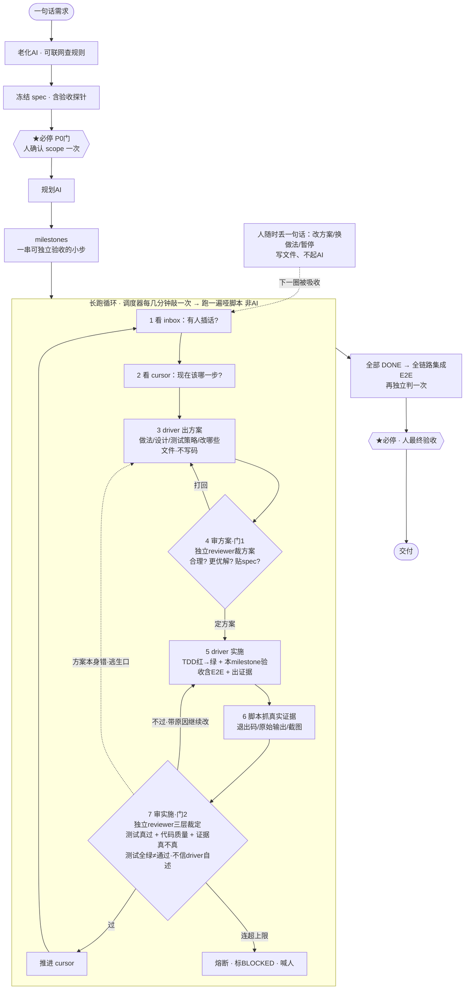

[English](./README.md) · **中文**

# longhaul-builder

**一句话需求 → AI 自主长跑 → 把一个中等规模（周级）的项目从头做完。**

一个 **agent / 基建无关、可移植**的「长跑自主构建循环」。你只要描述想做什么，它就能在无人值守的情况下持续推进：把需求聊清、写规格、拆步骤，然后挂上一个 AI 自驱循环一步步实现，崩了能续、卡住会喊人，最后让你验收。

> 设计与决策的**单一事实源**见 [`DESIGN.md`](./DESIGN.md)（中文）；安装步骤见 [`INSTALL.zh-CN.md`](./INSTALL.zh-CN.md)。本 README 只做导航。

---

## 这是什么 / 为什么有价值

普通的「让大模型写段代码」已经很成熟，但只能短期跑——上下文一长就跑偏、忘记目标、自评"通过了"却没真证据。

本框架的价值在**能无人值守长跑且不走偏**：

- **状态全在磁盘文件**，AI 从不常驻——每步"起来干一步就死"，不攒长上下文、不漂移。
- **每一步拿规格当锚**，并经过两道独立审查（审方案 + 审实施），不信 AI 的自述，只认真实运行证据。
- **崩了能续**：随时关掉会话、换台机器、第二天再来，从文件无损接着跑。
- **卡住会熔断**：连续失败到上限就停下、标记 BLOCKED、喊人，而不是无限空转。
- **人只在 2 处必停**（确认需求范围、最终验收），其余全自动；你也可以随时丢一句话干预。

如果一个构建任务短期就能做完，就用不上它；它是为「中到大、要分多步、跑很久」的项目设计的。

---

## 快速开始（你只跟 AI 说话，它自己跑）

前置：`claude`（和/或 `codex`）CLI + `git` + `python3`。把本仓 clone 到 agent 的 skill 目录（仓本身就是一个 skill，clone 完即装好）、`bin/` 加进 PATH。详见 [`INSTALL.zh-CN.md`](./INSTALL.zh-CN.md)。

然后**直接跟你的 coding agent（或接到 IM 的聊天入口）说**：

> 「我要做个新项目：<背景 / 想做成什么>」

AI 会自动完成下面这条链路：

1. **聊清需求**（人必停 1：确认 scope）
2. 自动写规格、拆出一串可独立验收的小步（milestone）
3. 挂上自驱循环：每拍出方案 → 独立判官审方案 → TDD 红绿实现 → 真跑探针取证 → 独立判官审实施
4. 你走开，它自己跑；卡住或做完来找你
5. **最终验收**（人必停 2）

底层 CLI 入口：`lhb new | plan | confirm | run | status | say`。

---

## 一图看懂运行流程



**三条关键读法**：

- 常驻的只有 2 样最便宜的东西——**调度器心跳 + 磁盘文件**；AI 从不常驻、只被"起来干一步就死"。
- 人**必停只有 2 个 ★**（确认范围 / 最终验收）；其余随时可插话（inbox），不插它自己跑。
- 不走偏 = 状态全在文件 + 短命 AI 不攒长上下文 + 每步拿 spec 当锚 + 熔断兜底。

---

## 依赖契约（只准依赖这些浅层、可移植的东西）

1. 一个能读写文件 + 跑 shell 的 coding agent（「一个 bot」）
2. `git` + 目录约定（状态台账）
3. 一个能定时 / 重复唤起的调度器（cron / CI / 前台 while-loop / flock）

**不绑定任何具体的团队/公司基建**——调度器、判官、看板、通知都可后接，但核心不依赖其中任何一个。

---

## 架构 / 结构

| 路径 | 作用 | 状态 |
| --- | --- | --- |
| `DESIGN.md` | 设计单一事实源（两层 + MVP + 风险） | ✅ |
| `engine/state.py` | 状态台账 / 程序计数器（确定性核心，CLI + 库） | ✅ 自测 10/10 |
| `engine/test_state.py` | state 机的四列证据表自测 | ✅ |
| `engine/age.*` | 老化脚手架：一句话 → 苏格拉底追问 + spec.md 骨架 | ✅ 骨架（需真 agent 细化） |
| `engine/plan.*` | 拆解脚手架：spec.md → milestones.json 骨架 | ✅ 骨架（需真 agent 细化） |
| `engine/loop.*` | 长跑 driver loop（确定性 tick + 两道门 + 熔断 + inbox + 看门狗 + 必停门） | ✅ |
| `engine/review.*` | 独立只读 reviewer（可配置判官 + 畸形稳健降级） | ✅ |
| `engine/verify.*` | 确定性证据闸（真跑探针、按真实退出码裁定、防作弊） | ✅ |

### 布局（框架不是项目的爹）

- 框架 `longhaul-builder/` = 纯机器，**不存任何项目状态**。
- 被建项目 = **独立平级仓**（如 `~/proj/<你的项目>/`），构建状态内置为它自己的 `.longhaul/`（像 `.git`，跟着项目走）。
- 跨项目跟进 = `~/.longhaul/registry.json` 注册表 + `lhb status` 聚合看板（多项目并行各自独立 loop + 一张总览）。

---

## 状态台账 CLI 速查（`<state_dir>` = 被建项目的 `.longhaul/`）

```
python3 engine/state.py init <state_dir> --one-liner "..."
python3 engine/state.py set-milestones <state_dir> --file milestones.json
python3 engine/state.py next <state_dir>            # 程序计数器：下一步该做啥
python3 engine/state.py claim <state_dir> <id>      # 认领（内建熔断，超 max_attempts 退出码 3）
python3 engine/state.py complete <state_dir> <id>   # 验收过 → DONE，推进 cursor
python3 engine/state.py fail <state_dir> <id> --error "..."  # 未过 → 重试 / 熔断
python3 engine/state.py p0-confirm <state_dir> [--by 谁]      # 必停门：人确认范围、放行 build
python3 engine/state.py note <state_dir> <id> "..."          # carry-forward：把 reviewer 非阻塞 nit 记进 notes.md
python3 engine/state.py status <state_dir>
```

老化 / 拆解脚手架（骨架，需真 agent 细化）+ 自驱循环：

```
python3 engine/age.py skeleton --one-liner "..." -o spec.md   # 一句话 → 带标准章节的 spec.md 骨架
python3 engine/plan.py spec.md -o milestones.json             # spec.md → milestones.json 骨架（AC→milestone stub）
engine/loop.sh <state_dir>                                    # cron/flock 包装：跑一个确定性 tick（推一相位）
```

---

## 已验证（dogfood 证据）

### 用例一：真实项目端到端建成

拿一个**多人桌游发身份的 web app**（阿瓦隆类）当靶子——多人登录、按严格规则发身份、各自只看到自己该看到的信息（梅林能看到坏人、其他人看不到等）。建成一个独立平级仓，由引擎自主长跑建出来。

结果：**7/7 milestone 全部 DONE，最终独立 judge 裁定 ACCEPT-READY（验收标准全过、零阻塞）**。完整审计链留在项目的 `.longhaul/` 目录里（spec 冻结 → 每个 milestone：方案→审方案→红/绿→审实施→截图 → 全链路集成验证 + 终态裁定）。

这次验证证明了能跑的：

- **状态外置可续跑** —— 途中会话被关又重开，从文件无损续上。
- **短命 agent** —— 每步起独立 driver/reviewer、干完即弃，主编排器不攒长上下文。
- **两道门两审** —— 每个 milestone 都要过"出方案→独立审方案→实施→独立审实施（三层裁定）"。门1 真拦下过测试缺口、可见性子句、浏览器版本错配等真问题。
- **不信自述** —— reviewer 都亲自复跑 / 攻击式查信息泄露 / 看截图，而不是采信 driver 说"过了"。
- **随时干预通道** —— 途中人多次投入"改进 review 模型 / 加心跳"等指令，下一圈即被吸收，未打断正在跑的步骤。

### 用例二：框架自托管（自举）

框架还**用自己的两道门循环建了它自己**：把 8 个自身优化项一路推到 DONE，审计链留在本仓 `.longhaul/`。覆盖 prompt/rubric 模板化、状态机两道门相位 + 熔断、确定性证据闸、可配置判官适配器、自驱 tick + cron/flock、干预 inbox、看门狗（lease+heartbeat+TTL）、收尾门（必停门 + carry-forward + 自托管 demo）。其中收尾项用循环本身无人值守驱动一个真 milestone、端到端产出了真实文件。

**诚实边界**：上述 demo 的 driver/judge 用的是**确定性命令**（证明的是"循环机器能自驱真任务"，不是"全自动 LLM 自建"）；真正的 LLM driver 是一层可后接的适配器（命令抽象已就位、尚未接线）；老化 / 拆解目前仍是骨架；门的自动强度分流已定义、尚未接线。详见 [`DESIGN.md`](./DESIGN.md) 的 roadmap 章节。
